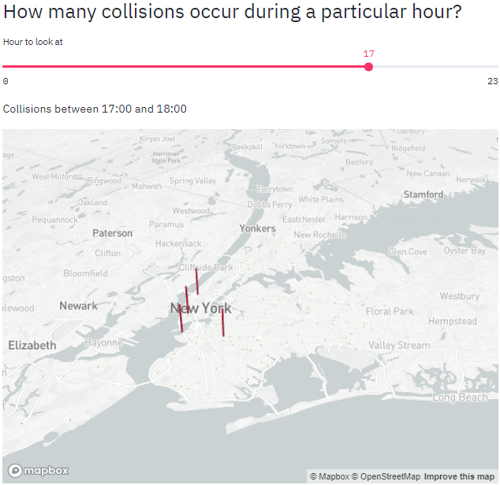

## New york Vehicle collision analysis 

> We use streamlit library of python to analyse data of New York Vehicle Collision and create visualize it on a web page.

All the necessary csv data can be found at [data](https://data.cityofnewyork.us/api/views/h9gi-nx95/rows.csv?accessType=DOWNLOAD)

## Streamlit Web App

> Where are most people injured?

> How many collisions occur during a particular hour?

> Breakdown by minute between hours...

> Raw data by minute between hours...

> Top 5 dangerous streets by affected class [Pedestrians]

> Top 5 dangerous streets by affected class [Motorists]

